# OWASP Top 10 2025: Application Design Flaws

Before we start working on the room challenges, let us see what OWASP means and what the Top 10 in 2025 actually is.

As we know, nowadays we use digital apps and systems widely, and those apps are created using code. Sometimes that code has a mistake in it. This mistake can be one of two things: a bug, or a security issue. If the mistake is a bug, it might cause something like an unresponsive button or a small glitch. But if the mistake causes a security issue, it can ruin a lot of things.

Developers may not even know about a security issue, because they're busy, or because it's a lot to study every single security issue that exists at once. So here became the main question: which security issues happen the most, and which ones cause the most damage?

This is where OWASP comes in. It's simply a volunteer community of security experts. Their goal is to figure out which security issues developers should know about the most. So they rank these issues, and that ranking is what we call the OWASP Top 10.

In this room, we'll look at the OWASP Top 10 for 2025 more specifically, four of its categories:

1. AS02: Security Misconfigurations
2. AS03: Software Supply Chain Failures
3. AS04: Cryptographic Failures
4. AS06: Insecure Design

---

## AS02: Security Misconfigurations

**So what actually is this?**

It happen when there is careless setup, defaults left on. The system had the *ability* to be secure, but somebody set it up carelessly, left a default password in place, or left a service switched on that should've been switched off. It's not a coding mistake it's a setup mistake. it is just like a company database admin default login password left as admin.

**Why should you care?**

Because these mistakes are often the easiest ones for attackers to find, and the damage can be huge. A hacker doesn't need to be a genius to try the default admin password on a login page, or to stumble across a storage folder that was accidentally left open to the whole internet. And with companies now running dozens of cloud services and APIs at once, one careless setting can be the crack that brings the whole thing down.

**Where this usually goes wrong:**

- Leaving default usernames and passwords untouched
- Services or ports left open to the internet that never needed to be
- Cloud storage (like S3 buckets) set to "public" by accident
- APIs that anyone can hit without logging in
- Error pages that spill out technical details attackers can use
- Old, unpatched software still running in production
- AI tools or endpoints left reachable with no access checks

**How we can fix it:**

Turn off anything you're not using. Change every default password before going live. Give people and systems only the access they actually need nothing more. Keep things patched. Don't let error messages show off your internal system details for example when login form build if the user enter wrong password or username the reply massage shouldn't have to specify the wrong part it should reply incorrect password or username.

### My walkthrough

The first challenge was: *navigate to MACHINE_IP:5002. It appears that the developers left too many traces in their User Management APIs.*

To get the flag I used Kali Linux by installing the VPN and connecting, rather than turning on the AttackBox.

To install the VPN in Kali, I went to my TryHackMe account, clicked VM and VPN settings,
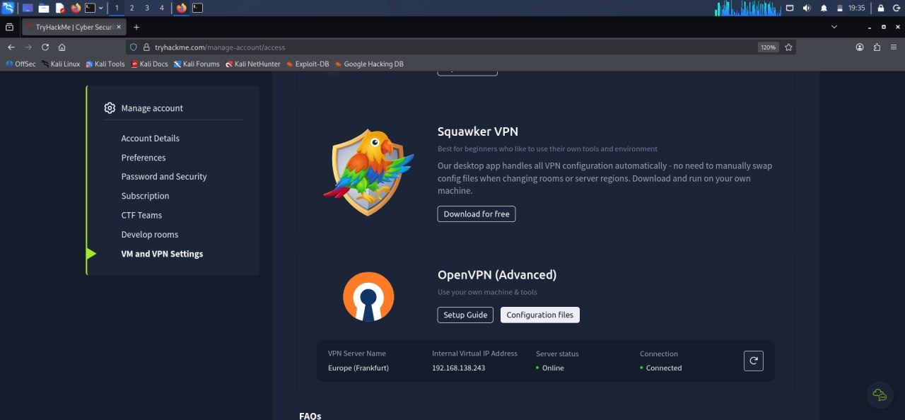

 and installed it,
 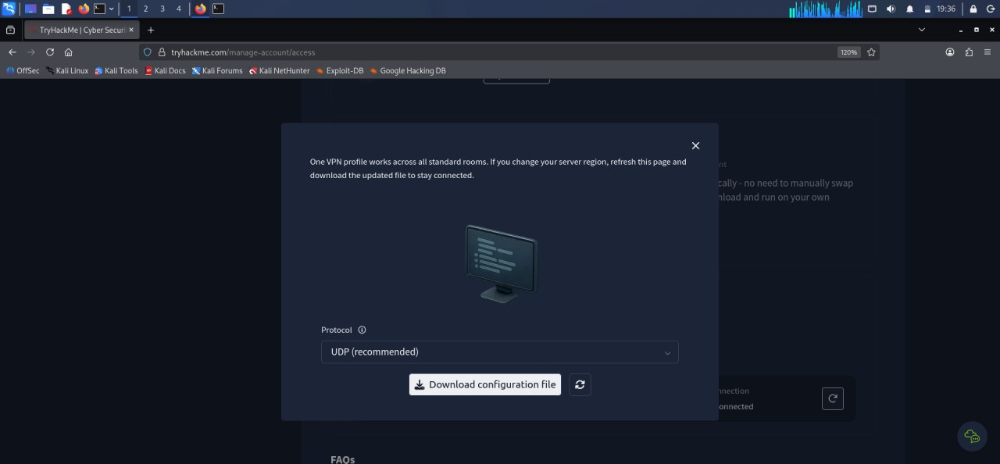
  then followed the setup procedure.

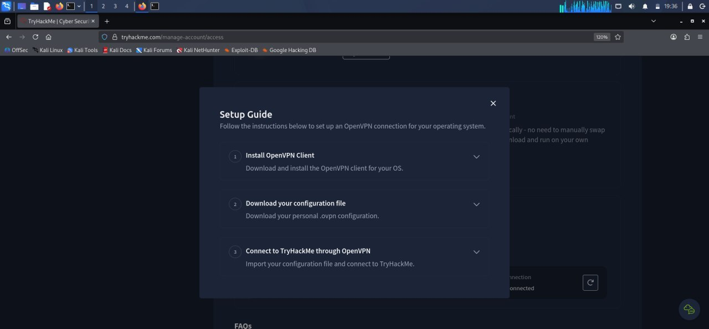

When I turned on the lab machine I got this IP address: `10.112.154.11`

Then I navigated to `10.112.154.11:5002` and got this page. It says: *Retrieve user information by ID. User ID must be numeric.*

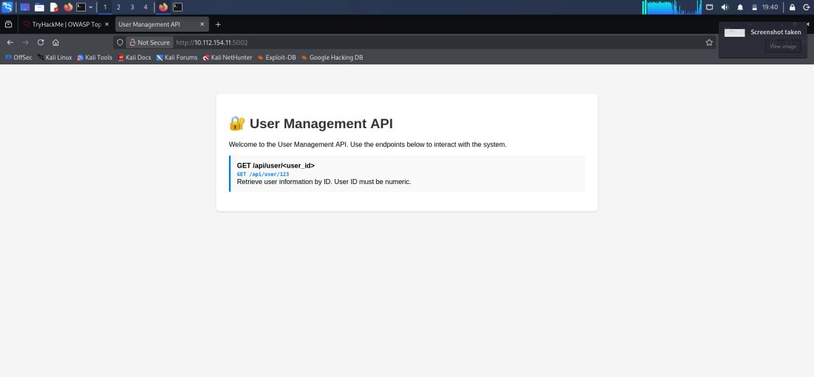

When I navigated with a numeric user ID, like `http://10.112.154.11:5002/api/user/123`, I got this:

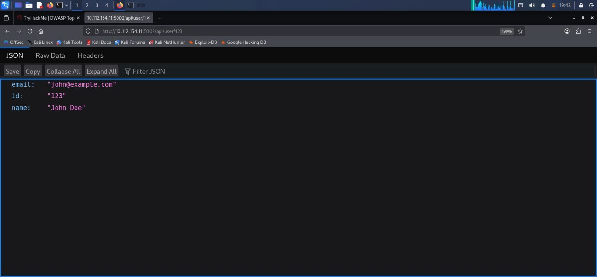

So I tried a letter instead of a number: `http://10.112.154.11:5002/api/user/abc`

Oops — I got the flag: `THM{V3RB0S3_3RR0R_L34K}`

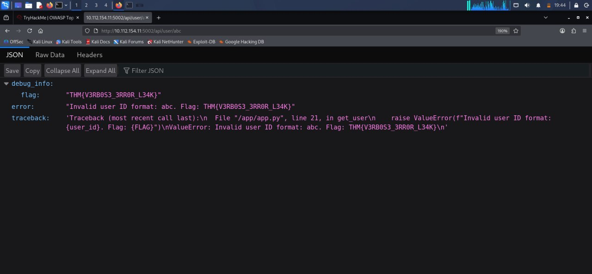

---

## AS03: Software Supply Chain Failures

**So what actually is this?**

Nobody builds an app completely from scratch anymore. Every project pulls in dozens (sometimes thousands) of pieces built by other people code libraries, plugins, even AI models. A supply chain failure is when one of those borrowed pieces turns out to be compromised, outdated, or was never checked properly in the first place. The scary part? The vulnerability isn't even in *your* code  it's in something you trusted and plugged in.

**Why should you care?**

Because one bad ingredient can spoil the whole meal. If an attacker manages to sneak malicious code into a popular library, every app using that library is now affected — without a single line of the app's own code being touched. These attacks spread fast and quietly, which makes them some of the hardest to catch.

**Where this usually goes wrong:**

- Using libraries nobody's maintaining anymore
- Letting updates auto-install with no verification step
- Trusting third-party AI models without checking them
- Build pipelines (CI/CD) that aren't locked down, so someone could tamper with them
- Not tracking where your components actually came from
- Never checking dependencies again after launch

**How you actually fix it:**

Check components before you use them  don't just grab and go. Keep everything patched, but also verify updates are genuinely legitimate before installing them (digital signatures help here). Lock down your build systems so outsiders can't slip something in. Keep a record of where every piece of your software came from. And build supply chain risks into your security thinking from day one, not as an afterthought.

### My walkthrough

The second challenge was: *navigate to 10.112.154.11:5003. The code is outdated and imports an old `lib/vulnerable_utils.py` component. Can you debug it?*
i use lab machine inside tryhackme and attackbox 
I got this page:

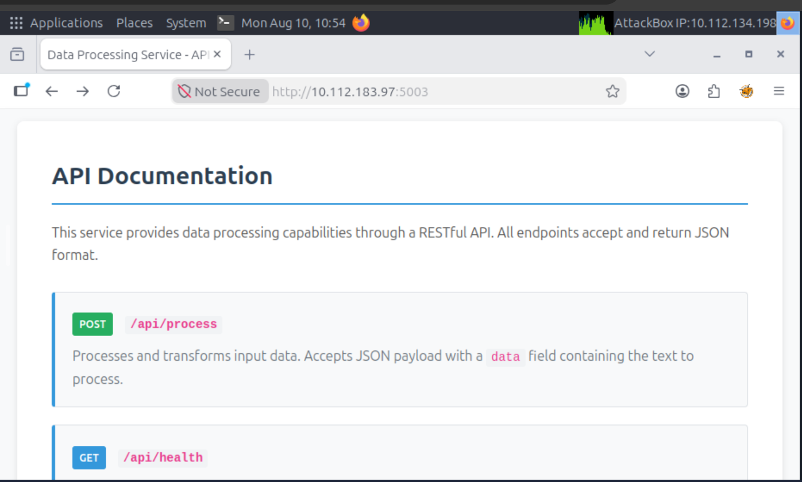

when i try the get request /api/health i get this:

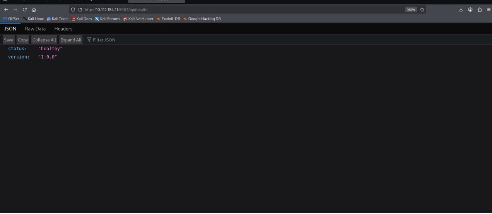

when i try the post request /api/process i get this:

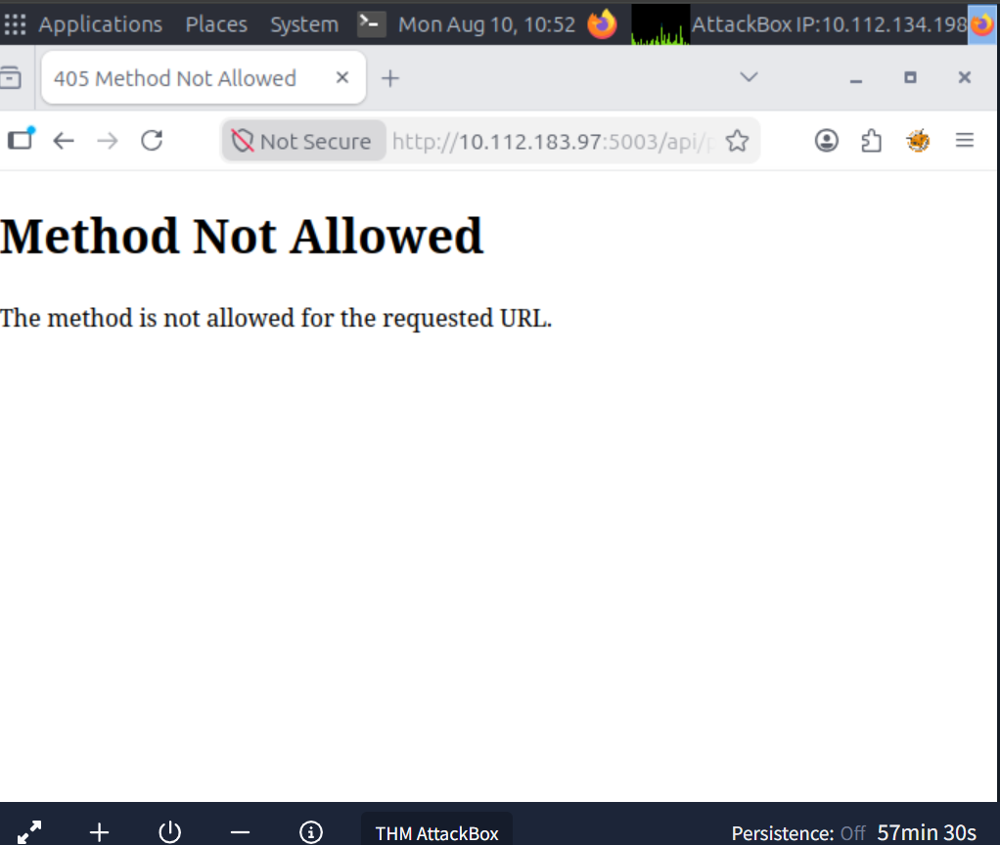

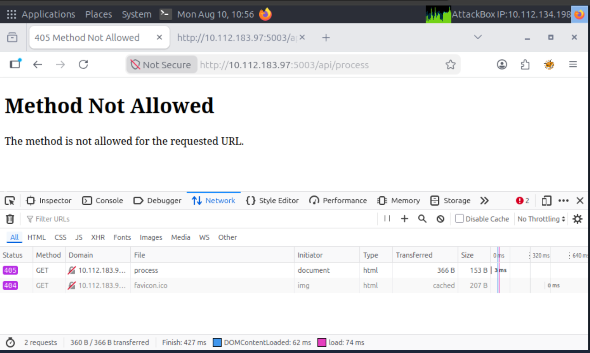

Then I tried to go inside network tab and got this:

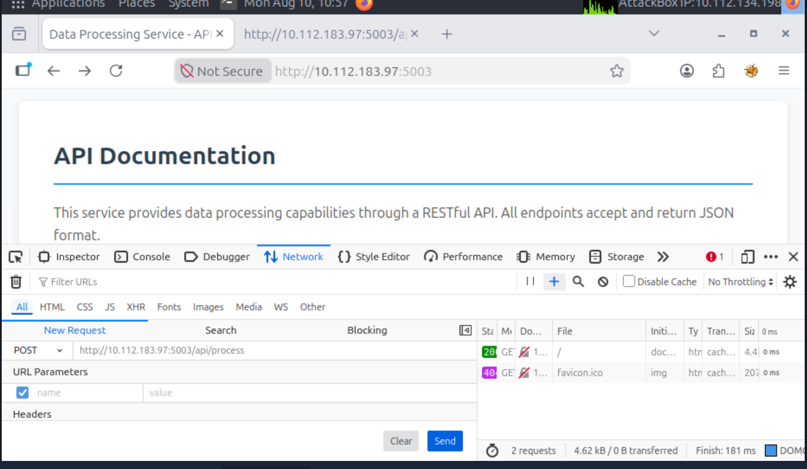

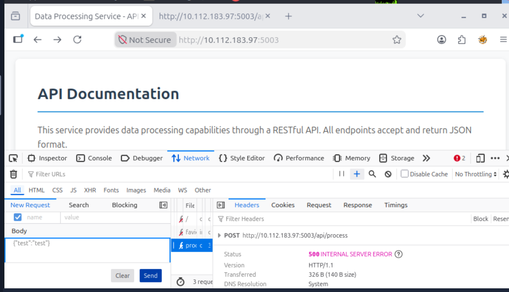

After that i write a sample request in body and got this:

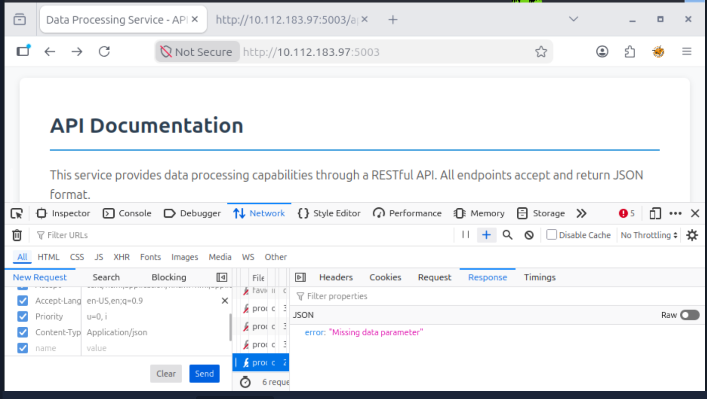

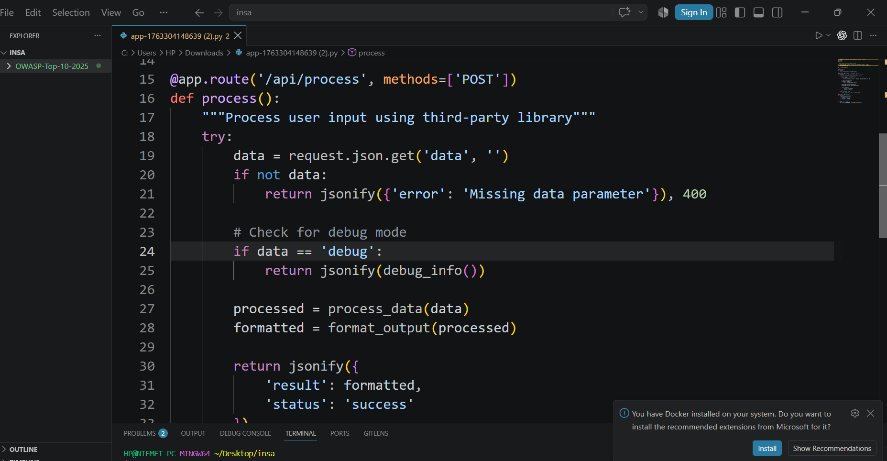

by following the outdated python code i try new parameter to debug it and got the flag there

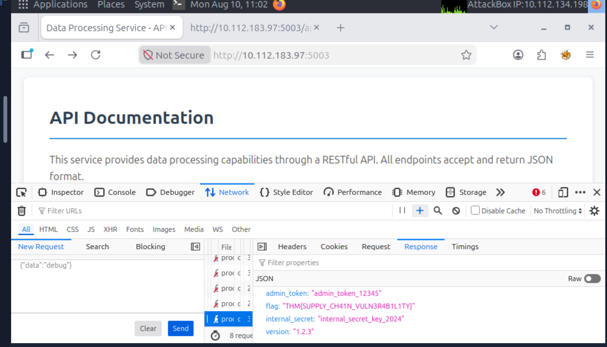

---

## AS04: Cryptographic Failures

**So what actually is this?**
A cryptographic failure happens when sensitive data isn't protected properly. Maybe passwords are stored in a weak hashing like MD5 instade of bycrept.

**Why should you care?**

Because encryption is quietly protecting almost everything  your passwords, your messages, your card details, your login sessions. When it fails, it doesn't fail small. Attackers can intercept your data mid-transit, crack weak passwords in bulk, or just find secrets sitting around in plain text.

**How this usually shows up:**

- Using old, broken algorithms like MD5 or SHA-1 (these were considered fine years ago, not anymore)
- Secret keys or passwords hardcoded directly into the code
- Encryption keys that never get rotated or updated
- Sensitive data stored or sent with no encryption at all
- Websites using invalid or self-signed security certificates
- AI systems that handle sensitive inputs without properly protecting them

**How you actually fix it:**

Use modern, trusted encryption standards  not something outdated or homemade. Store secrets in a proper key management system instead of in your code. Rotate your keys on a schedule instead of leaving them forever.

### My walkthrough

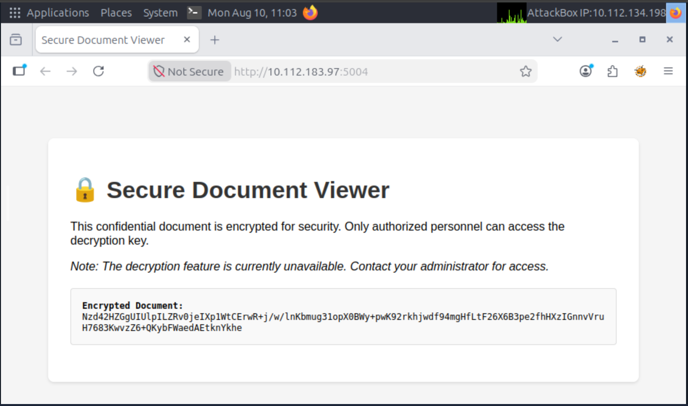

i use cyber chef to decrypt the text

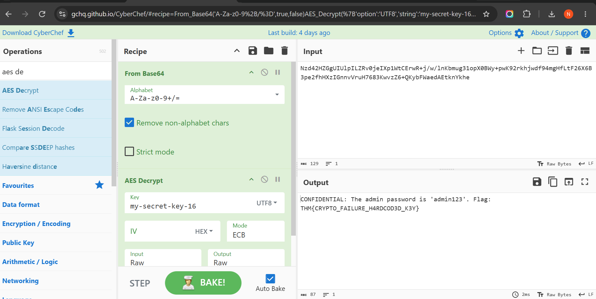

---

## AS06: Insecure Design

**So what actually is this?**

This is the trickiest one to wrap your head around, because it's not really a "mistake" in the normal sense  the system might be working *exactly* as it was built to. The problem is that it was never designed with security in mind in the first place. Nobody asked "how could this be abused?" before building it. You can't patch your way out of insecure design you basically have to go back and rebuild the thing properly.

**Why should you care?**

Because bugs get fixed with a quick patch. Bad design doesn't. If the whole system's logic assumes users will always behave nicely, or that an AI model will always give safe answers, that assumption is baked in everywhere  and ripping it out means redesigning how the whole system thinks, not just tweaking a line of code.

**Where this shows up a lot in 2025:**

- Weak logic around things like account recovery or approval steps
- Assuming users (or AI models) will always behave the way you expect
- Giving AI systems more power or access than they actually need
- Missing guardrails on AI chatbots or automated agents
- Debug or testing shortcuts that accidentally get left in the live product
- Never sitting down and asking "how could someone abuse this feature?"

**Insecure design gets weirder with AI in the picture.** A big one right now is prompt injection when a user's input gets mixed in with the AI's instructions, letting attackers hijack what the AI does or trick it into leaking things it shouldn't. There's also the risk of just blindly trusting whatever an AI outputs without a human checking it, and the risk of using AI models pulled from sketchy sources that might have hidden behavior built in.

**How you actually design around it:**

Treat every AI model like it can't be trusted until it proves otherwise. Check both what goes into a model and what comes out of it. Keep a model's instructions separate from whatever a user types in, so users can't rewrite the rules. Have a human double-check anything high-risk before it happens automatically. Think about how a feature could be abused *before* you build it, not after someone already has. And give every user, API, and service only the minimum access it actually needs to do its job — nothing extra "just in case."

### My walkthrough
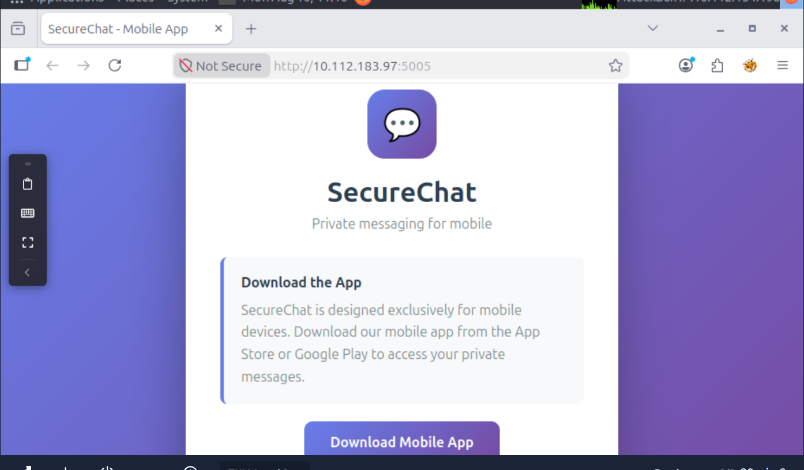

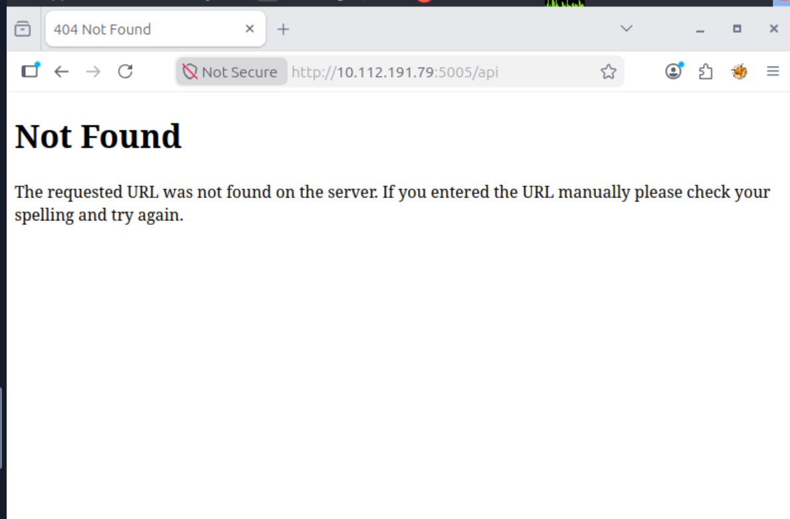

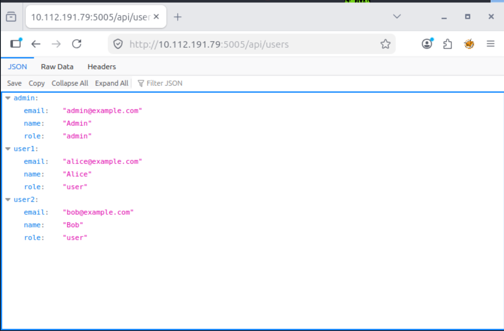

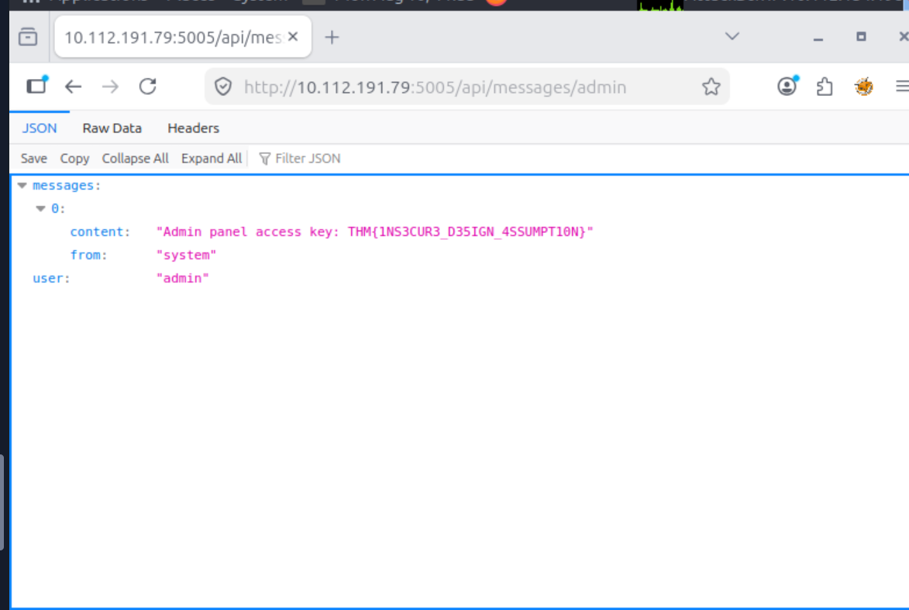
